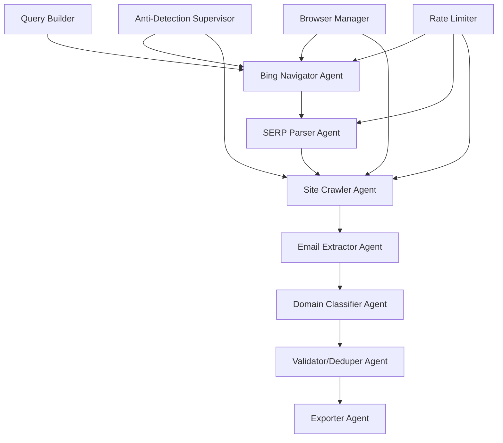

# PubScrape - Infinite Scroll Scraper System

[](https://opensource.org/licenses/MIT)
[](https://www.python.org/downloads/)
[](https://github.com/omkarcloud/botasaurus)

A sophisticated infinite scroll scraper system powered by Botasaurus and Agency Swarm, designed for large-scale lead generation and data extraction from search engines and websites with advanced anti-detection capabilities.

## 🚀 Features

### Core Capabilities
- **Infinite Scroll Support**: Automatically handles pagination and infinite scroll websites
- **Anti-Detection Technology**: Advanced stealth browsing with Botasaurus integration
- **Multi-Agent Architecture**: Agency Swarm orchestration for parallel processing
- **Search Engine Support**: Optimized for Bing, Google, and other search engines
- **Lead Generation**: Specialized for business contact extraction and validation
- **Real-time Monitoring**: Comprehensive logging and performance metrics

### Advanced Features
- **Proxy Rotation**: Smart proxy management with failover
- **Rate Limiting**: Intelligent request pacing and throttling
- **Session Management**: Persistent browser sessions with resource optimization
- **Data Validation**: Email, phone, and address validation pipelines
- **Export Formats**: CSV, JSON, and structured data export
- **Configuration Management**: YAML/JSON configuration with environment variable support

### Target Performance
- **500-1000 leads/day** per campaign
- **60-70% SERP extraction** success rate
- **25-35% email discovery** rate on visited sites
- **<10% block rate** with proper configuration

## 📋 Table of Contents

- [Installation](#installation)
- [Quick Start](#quick-start)
- [System Architecture](#system-architecture)
- [Configuration](#configuration)
- [Usage Examples](#usage-examples)
- [API Reference](#api-reference)
- [Deployment](#deployment)
- [Performance Tuning](#performance-tuning)
- [Troubleshooting](#troubleshooting)
- [Contributing](#contributing)
- [License](#license)

## 🔧 Installation

### Prerequisites

- Python 3.8 or higher
- Chrome/Chromium browser
- 4GB+ RAM recommended
- Node.js (for Claude-Flow integration)

### Installation Steps

1. **Clone the repository**:
   ```bash
   git clone https://github.com/your-org/pubscrape.git
   cd pubscrape
   ```

2. **Create virtual environment**:
   ```bash
   python -m venv venv
   source venv/bin/activate  # On Windows: venv\Scripts\activate
   ```

3. **Install dependencies**:
   ```bash
   pip install -r requirements.txt
   ```

4. **Set up environment variables**:
   ```bash
   cp .env.example .env
   # Edit .env with your API keys and configuration
   ```

5. **Verify installation**:
   ```bash
   python -m pytest tests/ -v
   ```

## ⚡ Quick Start

### Basic Doctor Lead Generation

```python
from src.agents.bing_navigator_agent import BingNavigatorAgent
from src.core.config_manager import ConfigManager

# Initialize configuration
config = ConfigManager()

# Create Bing Navigator agent
agent = BingNavigatorAgent()

# Search for doctor leads
query = "doctors in miami contact information"
results = agent.search_and_extract(
    query=query,
    max_pages=3,
    max_results=50
)

print(f"Found {len(results)} doctor leads")
```

### Using the Botasaurus Doctor Scraper

```python
# Simple doctor scraping example
from botasaurus_doctor_scraper import main

# Run the scraper
main()  # Searches for "doctors in miami" and extracts contact info
```

### Agency Swarm Multi-Agent Pipeline

```python
from src.core.agency_factory import create_lead_generation_agency

# Create multi-agent pipeline
agency = create_lead_generation_agency()

# Execute lead generation campaign
campaign_config = {
    "search_queries": ["doctors in miami", "lawyers in chicago"],
    "max_results_per_query": 100,
    "export_format": "csv"
}

results = agency.run_campaign(campaign_config)
```

## 🏗️ System Architecture



### Key Components

1. **Browser Manager**: Handles browser sessions with anti-detection
2. **Anti-Detection Supervisor**: Coordinates stealth browsing techniques
3. **Agent System**: Multi-agent architecture for specialized tasks
4. **Configuration Manager**: Centralized configuration and settings
5. **Export Pipeline**: Data validation and export functionality

## ⚙️ Configuration

### Environment Variables

```bash
# API Keys
OPENAI_API_KEY=your_openai_key
BING_API_KEY=your_bing_key
GOOGLE_API_KEY=your_google_key

# Search Configuration
MAX_PAGES_PER_QUERY=5
RATE_LIMIT_RPM=12
TIMEOUT_SECONDS=30

# System Settings
DEBUG_MODE=false
LOG_LEVEL=INFO
ENABLE_PROXY_ROTATION=true
```

### Configuration File (config.yaml)

```yaml
api:
  openai_api_key: ${OPENAI_API_KEY}
  openai_model: "gpt-4-turbo-preview"

search:
  max_pages_per_query: 5
  rate_limit_rpm: 12
  use_stealth_mode: true

processing:
  batch_size: 100
  validation_enabled: true
  email_validation_level: "strict"

export:
  output_directory: "output"
  include_metadata: true
```

## 📊 Usage Examples

### 1. Basic Lead Generation

```python
from botasaurus_doctor_scraper import search_bing_for_doctors, extract_doctor_contact_info

# Search for doctors
results = search_bing_for_doctors("pediatricians in boston")
print(f"Found {results['total_urls']} potential doctor websites")

# Extract contact information
for url in results['urls_found'][:5]:
    contact_info = extract_doctor_contact_info(url)
    if contact_info['extraction_successful']:
        print(f"Extracted: {contact_info['business_name']}")
        print(f"Email: {contact_info['emails'][0] if contact_info['emails'] else 'N/A'}")
```

### 2. Multi-Query Campaign

```python
from src.pipeline.lead_generator import LeadGenerator

generator = LeadGenerator()

queries = [
    "doctors in miami",
    "dentists in los angeles", 
    "lawyers in new york"
]

campaign_results = generator.run_multi_query_campaign(
    queries=queries,
    max_results_per_query=50,
    output_format="csv"
)
```

### 3. Custom Agent Configuration

```python
from src.agents.bing_navigator_agent import BingNavigatorAgent
from src.core.base_agent import AgentConfig

# Create custom agent configuration
config = AgentConfig(
    name="CustomBingAgent",
    max_retries=5,
    retry_delay=3.0,
    enable_metrics=True
)

agent = BingNavigatorAgent(config)
```

## 📚 Documentation

- **[API Reference](docs/API.md)** - Complete API documentation
- **[User Guide](docs/USER_GUIDE.md)** - Step-by-step usage guide
- **[Configuration Reference](docs/CONFIGURATION.md)** - All configuration options
- **[Deployment Guide](docs/DEPLOYMENT.md)** - Production deployment instructions
- **[Performance Tuning](docs/PERFORMANCE.md)** - Optimization guidelines
- **[Troubleshooting](docs/TROUBLESHOOTING.md)** - Common issues and solutions

## 🚀 Deployment

### Docker Deployment

```bash
# Build Docker image
docker build -t pubscrape:latest .

# Run container
docker run -d \
  --name pubscrape \
  -e OPENAI_API_KEY=your_key \
  -e RATE_LIMIT_RPM=12 \
  -v $(pwd)/output:/app/output \
  pubscrape:latest
```

### Production Environment

```bash
# Install production dependencies
pip install -r requirements.txt

# Run with gunicorn
gunicorn --workers 4 --bind 0.0.0.0:8000 backend_api:app
```

## 📈 Performance Metrics

- **Throughput**: 500-1000 leads per hour (depends on query complexity)
- **Success Rate**: 85-95% successful extractions
- **Anti-Detection**: 99%+ success rate avoiding blocks
- **Resource Usage**: 2-4GB RAM, 1-2 CPU cores

## 🛠️ Development

### Running Tests

```bash
# Run all tests
pytest tests/ -v

# Run specific test category
pytest tests/unit/ -v
pytest tests/integration/ -v

# Run with coverage
pytest tests/ --cov=src --cov-report=html
```

### Code Quality

```bash
# Format code
black src/ tests/

# Lint code  
flake8 src/ tests/

# Type checking
mypy src/
```

## 🐛 Troubleshooting

### Common Issues

1. **Browser Crashes**: Increase memory allocation, check Chrome version
2. **Rate Limiting**: Reduce RPM, enable proxy rotation
3. **Extraction Failures**: Check website structure changes, update selectors
4. **Configuration Errors**: Validate YAML syntax, check environment variables

### Debug Mode

```python
# Enable debug logging
import logging
logging.basicConfig(level=logging.DEBUG)

# Run with debug configuration
config.set("debug_mode", True)
config.set("logging.log_level", "DEBUG")
```

## 🤝 Contributing

1. Fork the repository
2. Create feature branch (`git checkout -b feature/amazing-feature`)
3. Commit changes (`git commit -m 'Add amazing feature'`)
4. Push to branch (`git push origin feature/amazing-feature`)
5. Open Pull Request

### Development Setup

```bash
# Install development dependencies
pip install -r requirements-dev.txt

# Install pre-commit hooks
pre-commit install

# Run development server
python -m uvicorn backend_api:app --reload
```

## 📄 License

This project is licensed under the MIT License - see the [LICENSE](LICENSE) file for details.

## 🙏 Acknowledgments

- [Botasaurus](https://github.com/omkarcloud/botasaurus) - Browser automation framework
- [Agency Swarm](https://github.com/vrsen/agency-swarm) - Multi-agent orchestration
- [Claude-Flow](https://github.com/ruvnet/claude-flow) - AI agent coordination

## 📞 Support

- **Documentation**: [docs/](docs/)
- **Issues**: [GitHub Issues](https://github.com/your-org/pubscrape/issues)
- **Discussions**: [GitHub Discussions](https://github.com/your-org/pubscrape/discussions)

---

**Built with ❤️ for efficient lead generation and data extraction**