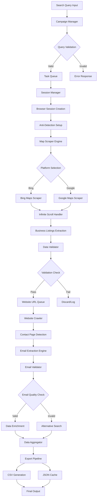

# Infinite Scroll Scraper System Architecture

## Executive Summary

This document outlines the architecture for a comprehensive infinite scroll scraper system using Botasaurus for anti-detection and browser automation. The system is designed to handle Bing Maps and Google Maps infinite scroll results, extract business information, visit websites for email discovery, and provide robust rate limiting and proxy rotation.

## Table of Contents

1. [System Overview](#system-overview)
2. [Architecture Components](#architecture-components)
3. [Data Flow Design](#data-flow-design)
4. [Integration Points](#integration-points)
5. [Anti-Detection Strategy](#anti-detection-strategy)
6. [Technology Stack](#technology-stack)
7. [Quality Attributes](#quality-attributes)
8. [Architectural Decision Records](#architectural-decision-records)

---

## System Overview

### High-Level Architecture Diagram

```
┌─────────────────────────────────────────────────────────────────┐
│                     INFINITE SCROLL SCRAPER SYSTEM              │
├─────────────────────────────────────────────────────────────────┤
│                                                                 │
│  ┌─────────────────┐    ┌─────────────────┐    ┌──────────────┐ │
│  │   Web Client    │    │  Task Manager   │    │   Admin UI   │ │
│  │   Dashboard     │    │   API Endpoint  │    │  Monitoring  │ │
│  └─────────────────┘    └─────────────────┘    └──────────────┘ │
│           │                       │                      │      │
│           └───────────────────────┼──────────────────────┘      │
│                                   │                             │
├─────────────────────────────────────────────────────────────────┤
│                          ORCHESTRATION LAYER                    │
├─────────────────────────────────────────────────────────────────┤
│                                   │                             │
│  ┌─────────────────────────────────┼─────────────────────────────┐ │
│  │           MAIN ORCHESTRATOR     │                           │ │
│  │  ┌─────────────────┐           │  ┌─────────────────────┐  │ │
│  │  │ Campaign Manager│           │  │  Session Manager    │  │ │
│  │  │ - Query Planning│           │  │  - Browser Sessions │  │ │
│  │  │ - Task Queuing  │           │  │  - Anti-Detection   │  │ │
│  │  │ - Progress Track│           │  │  - Proxy Rotation   │  │ │
│  │  └─────────────────┘           │  └─────────────────────┘  │ │
│  │                                │                           │ │
│  │  ┌─────────────────┐           │  ┌─────────────────────┐  │ │
│  │  │ Rate Limiter    │           │  │  Data Pipeline      │  │ │
│  │  │ - Request Queue │           │  │  - Validation       │  │ │
│  │  │ - Backoff Logic │           │  │  - Enrichment       │  │ │
│  │  │ - Health Monitor │           │  │  - Export           │  │ │
│  │  └─────────────────┘           │  └─────────────────────┘  │ │
│  └─────────────────────────────────┼─────────────────────────────┘ │
│                                   │                             │
├─────────────────────────────────────────────────────────────────┤
│                          PROCESSING LAYER                       │
├─────────────────────────────────────────────────────────────────┤
│                                   │                             │
│  ┌─────────────────┐    ┌─────────────────┐    ┌──────────────┐ │
│  │  Map Scraper    │    │ Website Crawler │    │Email Extractor│ │
│  │  - Bing Maps    │    │ - Contact Pages │    │ - Pattern     │ │
│  │  - Google Maps  │    │ - About Pages   │    │   Recognition │ │
│  │  - Infinite     │    │ - Social Media  │    │ - Validation  │ │
│  │    Scroll       │    │ - Deep Crawling │    │ - Enrichment  │ │
│  └─────────────────┘    └─────────────────┘    └──────────────┘ │
│           │                       │                      │      │
│           │              ┌─────────────────┐              │      │
│           │              │  Data Extractor │              │      │
│           │              │  - Business Info│              │      │
│           │              │  - Address Parse│              │      │
│           │              │  - Phone Format │              │      │
│           │              │  - Name Clean   │              │      │
│           │              └─────────────────┘              │      │
│           │                       │                      │      │
├─────────────────────────────────────────────────────────────────┤
│                         INFRASTRUCTURE LAYER                    │
├─────────────────────────────────────────────────────────────────┤
│                                   │                             │
│  ┌─────────────────┐    ┌─────────────────┐    ┌──────────────┐ │
│  │ Botasaurus      │    │ Proxy Manager   │    │ Data Storage │ │
│  │ Browser Engine  │    │ - Rotation Pool │    │ - SQLite DB  │ │
│  │ - Anti-Detect   │    │ - Health Check  │    │ - CSV Export │ │
│  │ - Session Mgmt  │    │ - Failover      │    │ - JSON Cache │ │
│  │ - Stealth Mode  │    │ - Rate Limits   │    │ - Backups    │ │
│  └─────────────────┘    └─────────────────┘    └──────────────┘ │
│           │                       │                      │      │
│           │              ┌─────────────────┐              │      │
│           │              │ Monitoring &    │              │      │
│           │              │ Logging         │              │      │
│           │              │ - Performance   │              │      │
│           │              │ - Error Tracking│              │      │
│           │              │ - Success Metrics│             │      │
│           │              └─────────────────┘              │      │
│           │                       │                      │      │
└─────────────────────────────────────────────────────────────────┘
```

### System Goals

1. **Scalability**: Handle infinite scroll mechanisms across different map platforms
2. **Reliability**: Robust error handling and recovery mechanisms
3. **Stealth**: Advanced anti-detection to avoid blocking
4. **Accuracy**: High-quality data extraction and validation
5. **Performance**: Efficient processing with rate limiting
6. **Maintainability**: Modular design for easy updates and extensions

---

## Architecture Components

### 1. Main Orchestrator
**Location**: `/src/orchestration/main_orchestrator.py`

**Responsibilities**:
- Campaign lifecycle management
- Task scheduling and distribution
- Resource allocation and monitoring
- Error handling and recovery
- Progress reporting and metrics

**Key Features**:
- Multi-threaded task execution
- Dynamic resource scaling
- Circuit breaker patterns
- Comprehensive logging

### 2. Map Scraper Engine
**Location**: `/src/scrapers/map_scraper/`

**Components**:
```python
# Component Breakdown:
class MapScraperEngine:
    - BingMapsInfiniteScroller
    - GoogleMapsInfiniteScroller  
    - ResultsAggregator
    - ScrollController
    - BusinessExtractor
```

**Responsibilities**:
- Execute infinite scroll actions
- Extract business listings
- Handle pagination and continuation tokens
- Maintain session state
- Implement platform-specific strategies

### 3. Website Crawler
**Location**: `/src/scrapers/website_crawler/`

**Components**:
```python
# Component Breakdown:
class WebsiteCrawler:
    - ContactPageDetector
    - NavigationMapper
    - ContentExtractor
    - LinkFollower
    - SocialMediaFinder
```

**Responsibilities**:
- Navigate business websites
- Identify contact pages
- Extract structured data
- Follow relevant internal links
- Handle dynamic content loading

### 4. Email Discovery Engine
**Location**: `/src/extractors/email_extractor/`

**Components**:
```python
# Component Breakdown:
class EmailExtractor:
    - PatternMatcher
    - EmailValidator
    - DomainAnalyzer
    - ContactFormDetector
    - SocialMediaEmailFinder
```

**Responsibilities**:
- Multi-pattern email detection
- Email validation and verification
- Contact form identification
- Social media account linking
- Email confidence scoring

### 5. Anti-Detection System
**Location**: `/src/anti_detection/`

**Components**:
```python
# Component Breakdown:
class AntiDetectionSystem:
    - BotasaurusManager
    - UserAgentRotator
    - BehaviorSimulator
    - FingerprintRandomizer
    - CaptchaSolver
```

**Responsibilities**:
- Browser fingerprint randomization
- Human-like behavior simulation
- User agent rotation
- Request timing optimization
- Captcha detection and solving

### 6. Rate Limiting & Proxy Management
**Location**: `/src/infrastructure/`

**Components**:
```python
# Component Breakdown:
class InfrastructureManager:
    - RateLimiter
    - ProxyPool
    - HealthMonitor
    - LoadBalancer
    - FailoverController
```

**Responsibilities**:
- Request rate limiting
- Proxy rotation and health checking
- Load balancing across resources
- Automatic failover handling
- Performance monitoring

---

## Data Flow Design

### Primary Data Flow: Search Query → Final CSV



### Secondary Data Flows

#### 1. Error Handling Flow
```
Error Detection → Classification → Recovery Strategy → Retry Logic → Escalation
```

#### 2. Rate Limiting Flow
```
Request → Rate Check → Queue/Delay → Proxy Selection → Execution
```

#### 3. Anti-Detection Flow
```
Session Start → Fingerprint Setup → Behavior Simulation → Request Execution → Pattern Monitoring
```

---

## Integration Points

### 1. Existing Botasaurus Scrapers Integration

**Current Scrapers to Integrate**:
- `botasaurus_doctor_scraper.py` - Medical practice scraping patterns
- `bing_scraper/` - Bing search integration and anti-detection
- `ted_botasaurus_scraper.py` - Conference speaker extraction patterns

**Integration Strategy**:
```python
# Unified Interface
class ScraperIntegration:
    def __init__(self):
        self.doctor_patterns = DoctorScraperPatterns()
        self.bing_engine = BingScraperEngine()
        self.ted_patterns = TEDScraperPatterns()
    
    def get_extraction_patterns(self, business_type: str):
        # Route to appropriate scraper patterns
        return self._route_patterns(business_type)
```

### 2. Agency Swarm Integration

**Integration Points**:
- `BingNavigator/` - Search execution agents
- `SerpParser/` - Search result parsing
- `EmailExtractor/` - Email discovery agents
- `SiteCrawler/` - Website navigation agents

**Coordination Protocol**:
```python
# Agent Coordination
class AgentCoordinator:
    def coordinate_scraping(self, campaign):
        # Distribute tasks across specialized agents
        bing_agent = self.spawn_agent('BingNavigator')
        parser_agent = self.spawn_agent('SerpParser')
        crawler_agent = self.spawn_agent('SiteCrawler')
        email_agent = self.spawn_agent('EmailExtractor')
        
        return self.orchestrate_pipeline(
            [bing_agent, parser_agent, crawler_agent, email_agent]
        )
```

### 3. Data Pipeline Integration

**Storage Integration**:
- SQLite database for structured data
- JSON cache for raw responses
- CSV export for final results
- File-based queue for task management

**API Integration**:
- REST API for campaign management
- WebSocket for real-time progress updates
- Webhook support for completion notifications

---

## Anti-Detection Strategy

### 1. Botasaurus-Based Anti-Detection

**Core Features**:
```python
@browser(
    headless=True,
    user_agent_rotation=True,
    block_images=True,
    stealth=True,
    proxy=dynamic_proxy_selection()
)
def anti_detect_scraper(driver, data):
    # Implement human-like behavior
    driver.human_like_delay('navigation')
    
    # Randomize interactions
    driver.random_mouse_movement()
    
    # Vary scroll patterns
    driver.natural_scroll_pattern()
```

**Detection Avoidance Techniques**:

1. **Fingerprint Randomization**
   - User agent rotation
   - Screen resolution variation
   - Browser language settings
   - Timezone randomization

2. **Behavioral Simulation**
   - Human-like delays (2-6 seconds)
   - Natural scroll patterns
   - Random mouse movements
   - Realistic typing speeds

3. **Session Management**
   - Browser profile rotation
   - Cookie management
   - Session isolation
   - Consistent identity per session

4. **Traffic Distribution**
   - Proxy rotation
   - Request spacing
   - Geographic distribution
   - ISP diversification

### 2. Rate Limiting Strategy

**Multi-Level Rate Limiting**:

1. **Global Limits**: System-wide request limits
2. **Domain Limits**: Per-domain request limits
3. **Session Limits**: Per-browser session limits
4. **Proxy Limits**: Per-proxy request limits

**Implementation**:
```python
class RateLimiter:
    def __init__(self):
        self.global_limiter = TokenBucket(rate=100, capacity=500)
        self.domain_limiters = {}
        self.session_limiters = {}
        
    async def acquire_permit(self, domain, session_id):
        # Multi-level rate limit check
        await self.global_limiter.acquire()
        await self.get_domain_limiter(domain).acquire()
        await self.get_session_limiter(session_id).acquire()
```

### 3. Proxy Management

**Proxy Pool Architecture**:
```python
class ProxyManager:
    def __init__(self):
        self.residential_pool = ResidentialProxyPool()
        self.datacenter_pool = DatacenterProxyPool()
        self.health_monitor = ProxyHealthMonitor()
        
    def get_optimal_proxy(self, target_domain):
        # Select proxy based on:
        # - Health status
        # - Geographic location
        # - Success rate for target domain
        # - Current load
        return self.strategy.select_proxy(target_domain)
```

---

## Technology Stack

### Core Technologies

1. **Browser Automation**: Botasaurus (v4.0.88+)
2. **Programming Language**: Python 3.11+
3. **Async Framework**: asyncio/aiohttp
4. **Database**: SQLite (with potential PostgreSQL upgrade)
5. **Queue System**: File-based with Redis upgrade path
6. **Monitoring**: Structured logging with ELK stack ready

### Dependencies

```python
# Core Dependencies
botasaurus>=4.0.88
selenium>=4.15.0
aiohttp>=3.8.0
asyncio-throttle>=1.0.0
fake-useragent>=1.4.0

# Data Processing
pandas>=2.0.0
beautifulsoup4>=4.12.0
lxml>=4.9.0
regex>=2023.0.0

# Database & Storage
sqlite3 (built-in)
sqlalchemy>=2.0.0

# Monitoring & Logging
structlog>=23.0.0
prometheus-client>=0.17.0

# Testing
pytest>=7.4.0
pytest-asyncio>=0.21.0
```

### External Services

1. **Proxy Providers**: Support for multiple providers
2. **Email Validation**: Hunter.io, ZeroBounce integration ready
3. **Captcha Solving**: 2captcha, Anti-Captcha integration
4. **Monitoring**: Prometheus/Grafana ready

---

## Quality Attributes

### 1. Performance

**Targets**:
- Process 1000+ businesses per hour
- Support 10+ concurrent browser sessions
- Email discovery rate >80%
- Response time <5 seconds per business

**Strategies**:
- Async/parallel processing
- Connection pooling
- Intelligent caching
- Resource optimization

### 2. Reliability

**Targets**:
- 99.5% uptime
- <1% data loss
- Automatic error recovery
- Graceful degradation

**Strategies**:
- Circuit breaker patterns
- Retry mechanisms with exponential backoff
- Health checks and monitoring
- Data persistence and recovery

### 3. Scalability

**Targets**:
- Scale to 100+ concurrent sessions
- Support multiple campaigns simultaneously
- Handle 10K+ businesses per campaign
- Linear performance scaling

**Strategies**:
- Microservice architecture
- Horizontal scaling support
- Load balancing
- Resource pooling

### 4. Security

**Targets**:
- Zero credential exposure
- Secure proxy communication
- Encrypted data storage
- Audit trail maintenance

**Strategies**:
- Environment-based configuration
- Encrypted database storage
- Secure proxy protocols
- Comprehensive logging

---

## Architectural Decision Records

### ADR-001: Botasaurus as Primary Browser Engine

**Status**: Accepted

**Context**: Need for robust anti-detection capabilities for map scraping

**Decision**: Use Botasaurus as the primary browser automation engine

**Rationale**:
- Built-in anti-detection features
- Proven success with Bing/Google scraping
- Active maintenance and updates
- Easy integration with existing codebase

**Consequences**:
- Positive: Advanced anti-detection, proven reliability
- Negative: Dependency on external library, learning curve

### ADR-002: Infinite Scroll Implementation Strategy

**Status**: Accepted

**Context**: Need to handle infinite scroll on both Bing Maps and Google Maps

**Decision**: Platform-specific scroll handlers with unified interface

**Rationale**:
- Different platforms have different scroll mechanisms
- Need flexibility for platform-specific optimizations
- Unified interface maintains code clarity

**Implementation**:
```python
class InfiniteScrollHandler:
    def __init__(self, platform):
        self.handler = self._get_platform_handler(platform)
    
    def scroll_to_load_more(self, max_items=None):
        return self.handler.execute_scroll(max_items)
```

### ADR-003: Data Storage Strategy

**Status**: Accepted

**Context**: Need for reliable data storage with export capabilities

**Decision**: SQLite for structured storage, CSV/JSON for exports

**Rationale**:
- SQLite provides ACID guarantees without server overhead
- CSV format for easy business use
- JSON for technical integrations
- No infrastructure dependencies

**Migration Path**: PostgreSQL for production scaling

### ADR-004: Rate Limiting Architecture

**Status**: Accepted

**Context**: Need to avoid detection while maintaining performance

**Decision**: Multi-level token bucket rate limiting

**Rationale**:
- Flexible rate control at multiple levels
- Token bucket allows for burst traffic
- Easy to tune for different targets
- Integrates well with proxy rotation

### ADR-005: Error Handling Strategy

**Status**: Accepted

**Context**: Need robust error handling for long-running scraping campaigns

**Decision**: Hierarchical error handling with retry strategies

**Implementation**:
```python
class ErrorHandler:
    def handle_error(self, error, context):
        if self.is_recoverable(error):
            return self.retry_strategy.execute(context)
        elif self.is_temporary(error):
            return self.backoff_strategy.execute(context)
        else:
            return self.escalation_strategy.execute(error, context)
```

---

## Next Steps

1. **Phase 1**: Implement main orchestrator and basic map scraping
2. **Phase 2**: Add website crawling and email extraction
3. **Phase 3**: Implement advanced anti-detection and proxy management
4. **Phase 4**: Add monitoring, reporting, and optimization features
5. **Phase 5**: Performance tuning and production hardening

This architecture provides a solid foundation for building a comprehensive infinite scroll scraper system that can handle the complexities of modern web scraping while maintaining stealth and reliability.